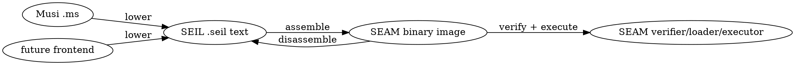
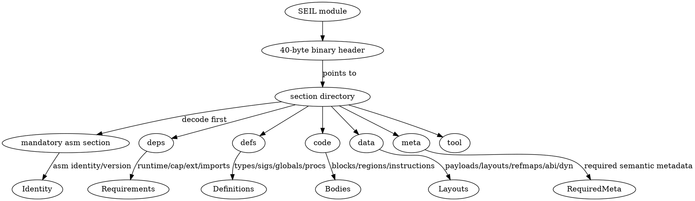

# LOCKED_LANGUAGE_DESIGN.md — Heavy Compressed Reference

Status: compact locked Musi design reference. Grammar snippets use W3C XML 1.0 EBNF style. Omitted forms are not accepted unless another locked section adds them.

## 1. Core invariants

- Small systems language, small core.
- Simplicity: easy learn/read/write/maintain.
- Explicivity: explicit + verbose; WYSIWYG; no hidden magic behind short spelling.
- Maintainability: long-term semantic stability beats short-term convenience.
- Flexibility rejected when it means many equivalent spellings; one obvious way per behavior.
- Code reduction not goal; more code acceptable when behavior becomes visible.
- Expression-first: no separate statement semantics; top-level `EXPR;` accepted; `;` sequences/discards; definitions/control flow are expressions.
- Musi lowers directly to SEIL; SEIL canonical executable form, CIL-like role.
- SEIL lower than ASTs: resolves ambiguity/removes redundant source forms.
- SEIL higher than disposable IR: preserves semantic types + source relation metadata.
- Every valid Musi program lowers to small SEIL core with clean executable semantics + syntax-directed typing.
- No IR layer between Musi and SEIL.
- Source lowers so SEIL-to-Musi decompilation can recover near-identical source when metadata preserved.
- Syntax preserves maximal munch, one-token lookahead, no speculation, no tradition-only forms.
- Any form needing >1 token lookahead is rejected/redesigned, even if familiar.

Notation atoms:

```ebnf
IDENT   ::= /* lexical identifier token */
EXPR    ::= /* expression production defined by final grammar */
TYPE    ::= /* type-expression production defined by final grammar */
PATTERN ::= /* pattern production defined by final grammar */
ATTR    ::= /* attribute production defined by final grammar */
```

## 2. Keywords and non-keywords

Keyword rule: keyword = hard-reserved source word required to introduce/disambiguate grammar. Built-ins, compiler names, intrinsics, methods, shapes, data/product/sum names, built-in types are not keywords unless grammar needs hard reservation.

Hard/form keywords, count 20:

```text
case cycle data defer else erased export fixed import known leave let match mut opaque shape unmanaged when while yield
```

Contextual/non-keyword decisions:

```text
in     = contextual word operator, not form keyword
as     = contextual pattern keyword, not cast syntax
await  = ordinary name
spawn  = ordinary name
task   = ordinary name
```

`import` and `export` hard keywords: `import` takes in; `export` puts out. `known import` = compile-time import/acquire. Module boundary forms affect source shape + SEIL/decompilation metadata.

Not core keywords:

```text
unsafe pin recur for break continue next trait hidden static const fn type struct enum class impl and or xor not is
```

## 3. Comments

Locked comment grammar:

```ebnf
line-comment       ::= "--" line-comment-text
line-doc-comment   ::= "---" line-comment-text
line-module-doc    ::= "--!" line-comment-text
block-comment      ::= "/-" block-comment-body "-/"
block-doc-comment  ::= "/--" block-comment-body "-/"
block-module-doc   ::= "/-!" block-comment-body "-/"
block-comment-body ::= (block-comment | block-doc-comment | block-module-doc | block-comment-char)*
```

Maximal munch: `--!` module doc; `---` doc; `/--` block doc; `/-!` block module doc. Block comment forms share one nesting system. Line comments inside block comments are text. Nested blocks use linear depth counter. Unterminated nested block = diagnostic. Module docs distinct from item docs.

## 3.1 Lexical literals and escaped identifiers

Numeric literal grammar:

```ebnf
digit-sep        ::= "_"
bin-prefix       ::= "0b" | "0B"
oct-prefix       ::= "0o" | "0O"
hex-prefix       ::= "0x" | "0X"
nat-suffix       ::= ("n" | "N") DIGITS
int-suffix       ::= ("i" | "I") DIGITS
float-suffix     ::= ("f" | "F") DIGITS
numeric-literal  ::= /* digits with optional `_` separators, base prefix, and numeric suffix */
multiline-string ::= "\"\"\"" multiline-string-body "\"\"\""
escaped-ident    ::= "`" escaped-ident-body "`"
```

Numeric rules:
- `_` separates digits; no value effect.
- Base prefixes accepted: `0x`/`0X`, `0o`/`0O`, `0b`/`0B`.
- Suffixes case-insensitive: `n64` = `N64`, `i32` = `I32`, `f64` = `F64`; canonical lowercase.
- `nX` = natural/unsigned width; `iX` = signed width; `fX` = float width.
- Unsuffixed non-negative integer = `Nat`; negative integer expr = `Int`; decimal point or `fX`/`FX` = `Float`.
- Unsupported target literal width = diagnostic.

```musi
1_000n32
0xff_n8
0XFFN8
0b1010_0110n8
0o755n16
1i64
-1
1.0f64
1F32
```

Multi-line strings use triple quotes.

```musi
"""
plain text
multiple lines
"""
```

Rules:
- Triple-quoted strings are strings, not templates.
- No interpolation in string literals; formatting/interpolation = explicit API/library behavior.
- Backticks are not string delimiters.
- `$` and `${` reserved for possible future interpolation; if added, direction is `$name` / `${EXPR}`.
- C#/Swift/template-literal modes and `{name}` interpolation are not core.
- No automatic indentation trim/dedent; delimiter contents are exact string contents.
- Indentation trim belongs in explicit library/API calls.

Backticks are Swift-like escaped identifiers.

```musi
let `when` := 1;
let `Type` := Type;
let `weird-name` := 2;
```

Rules:
- Escaped identifiers are identifiers, not strings.
- May spell keywords and lexer-permitted non-ordinary chars.
- Do not create operators; no interpolation; single-line only.
- Canonical/decompiler output prefers ordinary identifiers; use backticks only when required.

## 4. Universal binding and generics

`let` = universal binding for values, functions, data definitions, shape definitions, modules/imports, compile-time values, runtime values, receiver methods. No `fn`, `type`, `struct`, `enum`, `class`, `impl`, `const`, `static`.

```ebnf
let-expr              ::= "let" bind-head generic-param-list? type-annot? param-list? result-type? ":=" EXPR
                        | "let" receiver-head "." IDENT generic-param-list? param-list result-type? ":=" EXPR
bind-head             ::= IDENT | "_" | operator-name | PATTERN
receiver-head         ::= "(" IDENT type-annot ")"
generic-param-list    ::= "[" generic-param-list-body? "]"
generic-param-list-body ::= required-generic-param ("," required-generic-param)* ("," default-generic-param)* ","?
                          | default-generic-param ("," default-generic-param)* ","?
required-generic-param ::= IDENT type-annot?
default-generic-param  ::= IDENT type-annot? ":=" EXPR
param-list            ::= "(" param-list-body? ")"
param-list-body       ::= required-param ("," required-param)* ("," default-param)* ","?
                        | default-param ("," default-param)* ","?
required-param        ::= IDENT type-annot | IDENT type-annot?
default-param         ::= IDENT type-annot? ":=" EXPR
result-type           ::= type-annot
type-annot            ::= ":" TYPE
```

Defaults trail in every param list: function, method, constructor-like, variant payload, generic. Generic params sit between binding name and call params. Generic calls use bracket-before-call: `name[Int, 4](value)`, `point.Point.make[Int]()`, `name[N := 4](value)`, `name[_, 4](value)`.

Generic rules:

- Omitting bracket list asks compiler to infer all generic parameters.
- Explicit generic call arguments may be positional or named with `:=`.
- `_` in generic call argument is an explicit inference hole.
- Required generic parameters without explicit/defaulted/inferred value are diagnostics.
- Unresolved inference holes are diagnostics.
- Generic call arguments follow UALO.

Binding qualifiers:

```ebnf
let-binding        ::= "let" bind-head type-annot? ":=" EXPR
qualified-binding  ::= "let" bind-head ":" qualified-type ":=" EXPR
qualified-rhs-bind ::= "let" bind-head ":=" qualified-expr
qualified-type     ::= "known"? "fixed"? "unmanaged"? "mut"? TYPE
qualified-expr     ::= "known" EXPR | EXPR
```

Canonical qualifier order: `known fixed unmanaged mut TYPE`. Other orders absent from grammar and may be diagnostic/format canonicalization. Inference preserves RHS qualified type; does not invent/strip qualifiers.

## 5. Regions and separators

Computation regions:

```ebnf
computation-region ::= "(" computation-body? ")"
computation-body   ::= EXPR (";" EXPR)* ";"?
```

Inside computation regions, `;` sequences/discards. `(step1(); step2())` returns/effects `step2`; `(step1(); step2();) ` discards `step2` and produces `Unit` or empty stack effect. Leading `;` rejected.

Structural regions:

```ebnf
structural-region ::= "{" structural-body? "}"
structural-body   ::= structural-member (";" structural-member)* ";"?
structural-member ::= data-field | data-case | shape-member | match-case
```

Curly structural regions define members/fields/variants/cases/rule tables, not sequential computation. Structural `;` terminates member/rule; does not discard.

Trailing separator invariant:

```ebnf
comma-items     ::= EXPR ("," EXPR)* ","?
semicolon-items ::= structural-member (";" structural-member)* ";"?
```

Trailing separators only after item. No leading separators. Comma lists use `X ("," X)* ","?`; structural regions use `X (";" X)* ";"?`; computation regions use `;` as sequence/discard.

## 6. Conditional control, loops, defer, yield

Conditional syntax:

```ebnf
total-conditional ::= non-when-expr "when" non-when-expr "else" EXPR
guarded-emission  ::= non-when-expr "when" non-when-expr
non-when-expr     ::= /* expression production excluding unparenthesized when-expr */
```

Rules:

- `when` is postfix guard syntax, not prefix; no `then` keyword.
- Condition must be `Bit`.
- Total conditional branches must have compatible type/stack effect.
- `else` is explicit fallback.
- Bare `VALUE when CONDITION` is guarded zero-or-one emission only in contexts that consume zero-or-one emission.
- No hidden `Maybe`, `Unit`, bottom, or union is synthesized.
- Unparenthesized nested `when` is rejected in guarded value or condition position; use parentheses.
- `where` is not a guard keyword and has no core guard syntax.
- Universal postfix guard: `X when C` makes `X` conditional on `C`; `C : Bit`; `C` evaluates at the point where `X` would be admitted/registered/emitted/selected; each guarded context defines that meaning.

Loop syntax:

```ebnf
while-expr   ::= "while" EXPR computation-region
loop-control ::= "leave" | "cycle"
```

Rules: `while` only source loop. Zero-or-more repetition; condition `Bit`; body computation region; result `Unit`. `leave` exits nearest `while`; `cycle` skips rest and rechecks condition. No `for`, `break`, `continue`, `next`, `recur`. Iterable loops use functions/methods/shapes. Postcondition repetition uses sequencing + `while` or library helper. `recur` duplicates recursion, so rejected. `pin` not core; stable address uses `fixed`.

Defer/yield:

```ebnf
defer-expr ::= "defer" EXPR ("when" EXPR)?
yield-expr ::= "yield" EXPR?
```

`defer` registers cleanup for current computation region/scope exit; result `Unit`. Runs on normal exit and loop-control exits (`leave`, `cycle`). Cleanup order remains runtime/control design. `defer cleanup() when cond`: guard checked at registration; `Bit.True` registers; `Bit.False` skips; guard not re-evaluated; cleanup expr must be `Unit`; captures must remain valid by scope/lifetime rules.

`yield` core expression for resumable/generator-compatible contexts, not call. Elsewhere diagnostic. `yield expr` suspends/emits through enclosing protocol; yielded type must match output; bare `yield` only for `Unit`; local result `Unit`. Suspension not scope exit; `defer` does not run. Pending defers run on final exit/close/drop/cancel by runtime rules. Concurrency protocol/capability driven. `Task`, `Scheduler`, `Resumable`, `Generator`, `Stream` library/runtime names. `await`, `spawn`, `task` ordinary names.

## 7. Match and patterns

Match grammar:

```ebnf
match-expr        ::= "match" EXPR "{" match-case+ "}"
match-case        ::= "case" case-pattern-list case-guard? "=>" EXPR ";"
case-pattern-list ::= PATTERN ("," PATTERN)* ","?
case-guard        ::= "when" EXPR
lambda-expr       ::= '\\' param-list type-annot? "=>" EXPR
```

Rules: every arm starts `case` and ends `;`. `=>` is body/result arrow for match arms and lambdas. Arm `;` terminates structural case; does not discard selected value. Use computation-region final `;` to discard inside arm. Pattern alts use commas in one `case`, not `|`; alts share guard/body. Alt bindings must be compatible: same names with compatible types in every alt reaching body.

Exhaustiveness: `match` exhaustive by default; non-exhaustive = semantic error. Finite sum matches cover all variants or include `case _`. Guarded cases do not count as unconditional coverage. No `case else`; `else` belongs only to `when ... else`.

Guard eval: cases top-to-bottom; alts left-to-right. Pattern before guard. Guard runs only after matching alt, may reference bindings, must be `Bit`. False guard continues matching. Guards do not run for non-matches. First unguarded or guard-true match wins. Guarded cases = conditional coverage only.

Pattern grammar:

```ebnf
pattern              ::= alias-pattern
alias-pattern        ::= pattern-primary type-annot? ("as" identifier-pattern)?
pattern-primary      ::= wildcard-pattern | identifier-pattern | literal-pattern | variant-pattern | tuple-pattern | record-pattern | array-pattern | rest-pattern
wildcard-pattern     ::= "_"
identifier-pattern   ::= IDENT
literal-pattern      ::= INT | FLOAT | STRING | RUNE
variant-pattern      ::= "." IDENT pattern-args? | TYPE "." IDENT pattern-args?
pattern-args         ::= "(" (pattern ("," pattern)* ","?)? ")"
tuple-pattern        ::= "#(" (pattern ("," pattern)* ","?)? ")"
record-pattern       ::= "#{" (record-pattern-field ("," record-pattern-field)* ","?)? "}"
record-pattern-field ::= IDENT (":=" pattern)?
array-pattern        ::= "#[" (pattern ("," pattern)* ","?)? "]"
rest-pattern         ::= ".." identifier-pattern?
```

Pattern facts:

- Patterns mirror datum syntax for destructuring.
- Let binding heads may be patterns.
- Record shorthand `#{ name }` means `#{ name := name }`.
- `as` is contextual pattern alias, not cast syntax; alias binds whole matched value.
- In alts, aliases must be binding-compatible if shared body uses them.
- `_` matches and binds nothing.
- `_name` is an ordinary identifier if lexical grammar accepts it; it does not silence unused-binding checks.

Rest patterns:

```ebnf
rest-pattern         ::= ".." identifier-pattern?
array-rest-pattern   ::= ".." identifier-pattern?
record-rest-pattern  ::= ".." identifier-pattern?
```

At most one rest pattern per tuple/record/array. Array/record rest may ignore or bind remaining elements/fields. Tuple rest needs tuple-rest/variadic tuple semantics; until locked, tuple rest rejected.

## 8. Data, datum literals, construction

Data grammar:

```ebnf
data-expr              ::= attr-list? "data" data-body
data-body              ::= product-data-body | sum-data-body | empty-data-body
product-data-body      ::= "{" data-field (";" data-field)* ";"? "}"
sum-data-body          ::= "{" data-case (";" data-case)* ";"? "}"
empty-data-body        ::= "{" "}"
data-field             ::= "let" IDENT type-annot field-default? | "let" IDENT ":=" EXPR
field-default          ::= ":=" EXPR
data-case              ::= "case" IDENT variant-payload? case-tag?
variant-payload        ::= "(" variant-param-list? ")"
variant-param-list     ::= required-variant-param ("," required-variant-param)* ("," default-variant-param)* ","?
                         | default-variant-param ("," default-variant-param)* ","?
required-variant-param ::= IDENT type-annot | type-annot | TYPE
default-variant-param  ::= IDENT type-annot? ":=" EXPR
case-tag               ::= ":=" known-expr
known-expr             ::= EXPR /* context requires known value */
```

Rules: `data` only data-definition form. Body shape decides product/sum/empty. Product `let` entries and sum `case` entries never mix. `case ... := value` defines variant identity; tag/discriminant known + unique; omitted tags assigned by declaration order; payload defaults stay in payload params. Product and sum stay separate; compose by field when both needed. `data` body may bind associated data through `let`. Receiver methods outside `data`/`shape`: `let (self : Parent).method() := expr`. No `struct`, `enum`, `union`, `class`, `impl`.

Datum literals:

```ebnf
datum-literal      ::= tuple-datum | record-datum | array-datum
tuple-datum        ::= "#(" (EXPR ("," EXPR)* ","?)? ")"
record-datum       ::= "#{" (record-datum-field ("," record-datum-field)* ","?)? "}"
array-datum        ::= "#[" (EXPR ("," EXPR)* ","?)? "]"
record-datum-field ::= IDENT ":=" EXPR
```

Meanings: `#()` empty tuple datum → `Unit`; `#{}` empty record datum; `#[]` empty array/list datum needing type context. Plain `{...}` never value record literal. Plain `(...)` never tuple datum unless `#(`.

Type delimiters/indexing:

```ebnf
tuple-type          ::= "(" (TYPE ("," TYPE)* ","?)? ")"
array-list-type     ::= "[" array-bound? "]" TYPE
array-bound         ::= EXPR | EXPR ".." EXPR | EXPR "..<" EXPR
generic-application ::= TYPE "[" (TYPE ("," TYPE)* ","?)? "]"
tuple-field-access  ::= EXPR "." INT
array-index-access  ::= EXPR ".[" EXPR "]"
```

Array/list types: `[]T` dynamic/unbounded; `[N]T` exact known length; `[A .. B]T` inclusive known range; `[A ..< B]T` half-open known range. Bounds must be known `Nat`. Generic/type app: `T[A, B]`. Tuple fields use `pair.0`; array/list index uses `list.[0]`.

Construction:

```ebnf
product-construction ::= TYPE record-datum
inferred-product     ::= record-datum
sum-construction     ::= unqualified-variant | qualified-variant
unqualified-variant  ::= "." IDENT variant-args?
qualified-variant    ::= TYPE "." IDENT variant-args?
variant-args         ::= "(" (EXPR ("," EXPR)* ","?)? ")"
```

Rules: product construction uses named/unnamed record datum literals, not function-call syntax. Sum construction uses dot variant syntax, e.g. `.Some(Type)` or `Maybe.Some(Type)`.

## 9. Operators and expression parsing

Core has no user-defined symbolic operators. Only locked tokens have operator syntax. Domain ops use named functions/methods. Fixed tokens:

```text
. ?. .[ ?.[ #( #{ #[ : := :? :> :?> <: ~= |= = /= < <= > >= in + - * / % |< >| >+ @< @> & ^ | ~ ?? .. ..< => ->
```

`in` only core word operator; contextual in operator position. No `and`, `or`, `xor`, `not`, `is`, `lsh`, `rsh`, etc. Negated membership: `~(x in y)`.

Relations:

```ebnf
equality-op    ::= "=" | "/="
ordering-op    ::= "<" | "<=" | ">" | ">="
equivalence-op ::= "~="
membership-op  ::= "in"
```

`=` equality only, never assignment. `/=` inequality. `< <= > >=` ordering. `~=` type/equivalence, not approximate numeric equality. Approx equality uses named function/method due tolerance/units/error/domain/type dependence.

Binding/update:

```ebnf
binding-expr ::= "let" bind-head type-annot? ":=" EXPR
update-expr  ::= place-expr ":=" EXPR
place-expr   ::= IDENT | EXPR "." IDENT | EXPR "." INT | EXPR ".[" EXPR "]"
```

`:=` binds/defines/initializes/updates. Record/product datum fields use `:=` because they initialize. Updates require mutable access or equivalent capability. `:=` lowest precedence. Chained updates rejected; `a := b := c` diagnostic.

Algebra:

```ebnf
algebra-op ::= "&" | "|" | "^" | "~"
```

Meanings: `&` conjunction/bitwise-and/type intersection where proven; `|` disjunction/bitwise-or/type union; `^` xor/symmetric difference; `~` complement/not. No logical/bitwise split. Applies to `Bit`, `Word*`, `Bits[N]`, and type algebra where accepted. Guards require `Bit`; no truthiness. Short-circuiting is control flow via `when ... else` or `match`. Not core: `and or xor not && || ! &? |? ~? |>`.

`Bit` sum type with known discriminants. `true`/`false` ordinary predefined/core bindings, not keywords. Canonical variants: `Bit.True`, `Bit.False`; shorthand `.True`/`.False` allowed when expected `Bit`.

```musi
export let Bit := data { case False := 0; case True := 1; };
export let true : Bit := Bit.True;
export let false : Bit := Bit.False;
```

Parser tiers:

```ebnf
postfix-expr      ::= EXPR postfix-op+
postfix-op        ::= "." IDENT | "." INT | ".[" EXPR "]" | "?." IDENT | "?.[" EXPR "]" | generic-call-args | call-args
generic-call-args ::= "[" arg-list? "]"
prefix-expr       ::= prefix-op EXPR
prefix-op         ::= "known" | "fixed" | "mut" | "?" | "~" | "-"
multiplicative-op ::= "*" | "/" | "%"
additive-op       ::= "+" | "-"
shift-op          ::= "|<" | ">|" | ">+"
rotate-op         ::= "@<" | "@>"
range-op          ::= ".." | "..<"
relation-op       ::= "<" | "<=" | ">" | ">=" | "=" | "/=" | "~=" | ":?" | ":>" | ":?>" | "<:" | "|=" | "in"
algebra-and-op    ::= "&"
algebra-xor-op    ::= "^"
algebra-or-op     ::= "|"
nil-coalesce-op   ::= "??"
conditional-op    ::= "when"
binding-op        ::= ":="
```

Precedence high→low:

1. postfix access/call/index
2. prefix unary/modifiers
3. callable arrow in type position `->`
4. `* / %`
5. `+ -`
6. shifts/rotates `|< >| >+ @< @>`
7. ranges `.. ..<`
8. relation/type/equality/membership `< <= > >= = /= ~= :? :> :?> <: |= in`
9. `&`
10. `^`
11. `|`
12. `??`
13. `when ... else` / `when`
14. `:=`

Rules: expressions parse by precedence, not flat semantic chain. `%` = CPU remainder, not mathematical modulo; true modulo uses named op like `mod(a,b)`. Shift/rotate are maximal-munch tokens. No `<<`/`>>`; left shift is `|<` and zero-fills low bits. Algebra precedence: `&` > `^` > `|`. Relations/type/equality non-chainable. `??` right-assoc and Maybe-only. Shifts: `|<` zero-left; `>|` zero-right; `>+` sign-right; `@<` rotate-left; `@>` rotate-right.

### UDNS and UFCS

UDNS = Universal Dot Notation Syntax. Dot notation covers member access, receiver-method access, tuple field access, namespace/module access, variant qualification, optional access, and indexed access compounds.

```ebnf
dot-postfix ::= "." IDENT | "." INT | ".[" EXPR "]" | "?." IDENT | "?." IDENT call-args | "?.[" EXPR "]"
```

Owned shapes: `value.member`, `value.method(args)`, `tuple.0`, `module.item`, `Type.Variant(args)`, `.Some(args)`, `value?.member`, `value?.method(args)`, `value.[index]`, `value?.[index]`.

UFCS = semantic resolution over UDNS. Receiver methods from `let (self : T).method(...) := ...` use same dot/call surface as ordinary members. `|>` absent; UDNS/UFCS are fluent composition.

UDNS resolution order for `x.foo` / `x.foo(args)`:

1. direct member/field/variant/module-record member
2. shape member required by known static type/constraint
3. attached receiver method
4. explicit dynamic/capability member operation only for `Any`, `opaque`, or capability-gated type

Same-priority ambiguity = diagnostic. Higher-priority unusable candidate = diagnostic; no fallback. Direct structure owns dot names. Receiver methods do not shadow fields/shape members. If `x.foo` direct field is non-callable and receiver method `foo` exists, `x.foo()` diagnoses non-callable member. `Any` has no implicit duck-dot; dynamic lookup explicit. No receiver-method escape syntax; qualify through ordinary UDNS/module/type paths.

## 10. Type-system surface

Musi uses bidirectional type checking/inference.

Rules:

- Missing annotations request inference, not dynamic fallback.
- Annotations push expected types inward; expressions synthesize types outward.
- Inference chooses the most precise/principal supported type.
- Irresolvable ambiguity is diagnostic.
- Inference never silently inserts `Any`.
- Dynamic boundaries must be explicit through annotation, conversion, import/FFI boundary, or API return type.
- Inferred structural, row, and capability constraints are ordinary Musi type info.

Core lattice/types:

```ebnf
universe-type    ::= "Type" "[" EXPR "]"
universe-param   ::= "known" IDENT ":" "Nat"
type-alias       ::= "Type"
type-hole        ::= "_"
any-type         ::= "Any"
unit-type        ::= "Unit" | "()"
empty-type       ::= "Empty"
error-type       ::= "Error"
structural-type  ::= record-type | row-type | capability-type
```

Facts:

- `Type[N]` is primitive universe use form; `N` is `known Nat`; runtime/non-known `N` is diagnostic.
- Known requirements are explicit at definition sites; call sites omit `known` because callee/form declares requirement.
- `Type[N] : Type[N + 1]`.
- `Type` is predefined core binding alias: `export let Type := Type[0];`.
- `type` remains not keyword. `Type0`, `Type1`, etc. are not built-in source forms unless defined.
- `()` canonicalizes to `Unit`.
- `Empty` is uninhabited bottom, not empty tuple; expression of type `Empty` may fit any required result because it never returns.
- `Any` is explicit dynamic top value type; not null, absence, failure, callable-anything, or permission to ignore effects/capabilities.
- Dynamic-to-static use requires `:?>` or explicit checked operation.
- Static-to-dynamic use is explicit via annotation/conversion/dynamic boundary.
- `Error` is built-in non-keyword top error type. Specific errors such as `AnyError`, `CastError` subtype `Error`.
- Unannotated record datum may infer anonymous structural record/row type, not `Any`.
- FFI/exported ABI boundaries require explicit representable types or representation metadata; anonymous structural/row types do not silently become ABI types.

Type annotation:

```ebnf
type-annot         ::= ":" TYPE
annotated-name     ::= IDENT type-annot
annotated-result   ::= param-list type-annot
annotated-receiver ::= "(" IDENT type-annot ")"
annotated-pattern  ::= PATTERN type-annot
```

`:` applies to value, parameter, field, result, receiver, pattern, and shape-member positions. It is not cast/subtype/type-test/equivalence/conformance syntax.

Callable types:

```ebnf
callable-type        ::= callable-input "->" TYPE
callable-input       ::= TYPE | tuple-type
multi-input-callable ::= "(" TYPE ("," TYPE)+ ","? ")" "->" TYPE
source-callable-type ::= callable-type
seil-callable-type   ::= callable-type
```

`->` is type-space callable arrow, not expression currying. `Unit` is canonical zero-information result. `()` is empty tuple type shape → `Unit`. Chained arrows require explicit design; use parentheses (`A -> (B -> C)`, `(A, B) -> C`). Musi source and SEIL metadata share callable type surface. No source stack-effect bracket syntax. SEIL verifies lowered stack behavior while metadata preserves callable types for near-identical decompilation.

Stack-effect compatibility:

- Total conditionals require `cond : Bit`; branches unify to one observable result/effect; `Empty` branch lets other determine result; expected context pushes into both branches.
- Bare guarded emission produces zero-or-one emission accepted only by consuming context.
- `match` arms unify to one observable result/effect; `Empty` arms do not force result; guarded arms only conditional coverage; match exhaustive.
- `defer : Unit`; cleanup expression `Unit`; cleanup effect attaches to scope/region exit, not local result; cleanup cannot consume non-live values.
- `yield` only in compatible resumable/generator callable contexts; yielded value matches output protocol; local result `Unit`; suspension not scope exit; `defer` not run on suspension; pending defers run on final exit/close/drop/cancel.
- Receiver methods treat receiver as semantic first input/capability; receiver syntax preserved by source metadata/decompilation; receiver mutability/stability comes from receiver type: `T`, `mut T`, `fixed T`, `fixed mut T`.

Type algebra:

```ebnf
type-union        ::= TYPE "|" TYPE
type-intersection ::= TYPE "&" TYPE
type-difference   ::= TYPE "^" TYPE
type-complement   ::= "~" TYPE
```

Meanings: `A | B` union; `A & B` intersection; `A ^ B` symmetric difference; `~A` complement within relevant type universe. Derived law: `A ^ B = (A | B) & ~(A & B)`.

Normalization laws:

```text
A|A=A; A&A=A; A|Empty=A; A&Empty=Empty; A|Any=Any; A&Any=A; ~~A=A; A^A=Empty; A^Empty=A; A^Any=~A
```

Subtyping/equivalence facts: `A <: B` iff `A | B ~= B`; `A & B <: A`; `A & B <: B`. Complement/symmetric difference accepted only where universe makes them normalizable/checkable; ambiguous/non-normalizable type algebra is diagnostic. Type algebra is type space; ABI/FFI representability checked separately. Algebraic types do not silently become ABI-safe tagged unions/layout records. No `iff`, `<=>`, `<->`, `=>`, `==` for type logic. Type equivalence `~=`; subtyping `<:`.

UALO = Universal Argument-List Ordering:

```ebnf
arg-list       ::= positional-arg ("," positional-arg)* ("," named-arg)* ","? | named-arg ("," named-arg)* ","?
positional-arg ::= "_" | EXPR
named-arg      ::= IDENT ":=" EXPR
call-args      ::= "(" arg-list? ")"
```

Rules: positional arguments first; named arguments after; once named starts, positional cannot resume; definition defaults trail; duplicate/unknown named args diagnostic; same parameter cannot be bound twice. Applies to ordinary calls, generic calls, attributes, parameter/default definitions, named variant payload calls, and future argument-list-shaped syntax. Variant payload calls accept named arguments under UALO, e.g. `.Point(x := 1, y := 2)`. UALO is a surface invariant; receiver-style callable access uses ordinary binding/call semantics.

Type-operator family:

```ebnf
type-test            ::= EXPR ":?" TYPE
static-cast          ::= EXPR ":>" TYPE
checked-cast         ::= EXPR ":?>" TYPE
subtype-relation     ::= TYPE "<:" TYPE
type-equivalence     ::= TYPE "~=" TYPE
conformance-relation ::= TYPE "|=" TYPE
```

Meanings: `:` annotation; `:?` runtime type test → `Bit`; `:>` explicit static conversion/cast, not runtime checked; `:?>` checked runtime cast → explicit failure-capable result; `<:` subtype; `~=` type equivalence; `|=` shape conformance/fits. `:?` never returns narrowed value. `:?>` never returns `Bit`. `?=` is not accepted.

Optional/Maybe:

```ebnf
optional-type   ::= "?" TYPE
maybe-fallback  ::= EXPR "??" EXPR
optional-access ::= EXPR "?." IDENT | EXPR "?." IDENT call-args | EXPR "?.[" EXPR "]"
```

`?T` is `Maybe[T]`. `?` does not name `Expect`. `??` only for `?T`/`Maybe[T]`; fallback lazy; result `T`. `?.` only for `?T`/`Maybe[T]`; access/call/index only when present; absent stays absent; no null invented; composes with `??`. `when ... else` branches on `Bit`; `??` branches on optional presence; `?.` propagates absence. `Expect` remains explicit; no failure-propagation sugar exists in core Musi.

Expect/checked casts:

```ebnf
expect-type         ::= "Expect" "[" TYPE "," TYPE "]"
checked-cast-result ::= "Expect" "[" TYPE "," "CastError" "]"
```

`:?>` returns `Expect[Target, CastError]`. No locked `Expect` sugar. `?T`, `??`, `?.` are Maybe-only. Failed casts carry error info. `CastError <: Error`. No hidden exceptions.

Dynamic `Any` capabilities:

- `Any` does not imply implicit dot/call/index lookup.
- Dynamic ops are explicit witness-required shapes: e.g. `AnyMember.member(name) : Expect[Any, AnyError]`, `AnyIndex.index(key) : Expect[Any, AnyError]`, `AnyCall.call(name,args) : Expect[Any, AnyError]`.
- `AnyMember`, `AnyIndex`, `AnyCall`, `AnyError`, `Error` are ordinary built-in/library/runtime names, not keywords.
- `AnyError <: Error`; APIs may widen to `Expect[Any, Error]`.
- `Any` values do not automatically provide dynamic capabilities; APIs decide which values carry/provide them.

Fixed storage:

```ebnf
fixed-type     ::= "fixed" TYPE
fixed-mut-type ::= "fixed" "mut" TYPE
unmanaged-type ::= "unmanaged" TYPE
qualified-type ::= "known"? "fixed"? "unmanaged"? "mut"? TYPE
```

`fixed T` = stable storage for value lifetime; collector/runtime may not move it then. Not static/global/immutable/known/type-owned/permanent/thread-safe. Orthogonal: `fixed T` stable; `mut T` writable; `fixed mut T` both. Managed address/access requires `fixed`; moving values expose no stable address/access. No `pin`; `fixed` owns pin semantics. Temporary non-moving access uses explicit APIs/capabilities. Non-`fixed` stable address/access = error. FFI stable access needs `fixed` or explicit copy/borrow.

`unmanaged T` = `T` outside managed tracing, movement, reclamation. Keyword because ownership/runtime semantics change. Does not imply mutability, fixed storage, valid address, provenance, bounds, or cleanup. Allocation/lifetime/cleanup/region authority explicit through `Region`, allocator, FFI, or runtime APIs. Managed refs inside unmanaged storage need explicit core metadata for tracing/representation. No `@unmanaged`.

Opaque/erased:

```ebnf
opaque-type ::= "opaque" TYPE
erased-type ::= "erased" TYPE
```

Type modifiers, not attributes. They affect identity, representation, dispatch, checking, ABI/SEIL metadata, decompilation. `hidden` gone. Use `opaque` for existential hiding, `erased` for one hidden concrete result type, `export`/absence for visibility, attributes for ABI/interop/layout.

## 11. Known phase

`known` is a phase modifier asking whether something can be compile-time. It is not `const` or `static`.

Rules:

- `known expr` requests/requires compile-time evaluation.
- `known T` requires compile-time-known value/type-phase value of type `T`.
- `known` appears only where compile-time availability is meaningful.
- Known requirements explicit at definition sites using `known` in type position.
- Call sites to known-required params do not repeat `known`; compiler checks argument is known.
- If context already requires knownness, spelling omitted at use site.
- If value cannot be compile-time, diagnostic.
- Without `known`, evaluation is runtime unless context requires knownness.
- Known phase can construct datum literals when contained values are known-compatible.
- Case tags/discriminants and array/list bounds require known values by context.
- `known import` is compile-time acquisition/import.

Boundary: known code may use only known values/imports, type info, and deterministic `musi:rt` known intrinsics. It cannot capture runtime values. Known→runtime allowed by embedding/lowering result. Runtime→known forbidden.

Known functions lower to SEIL; known eval runs verified SEIL in known phase. No separate source evaluator. Deterministic + resource-limited: no ambient state, time, random, env, process, IO, target mutable runtime, unless explicit deterministic known import/`musi:rt` intrinsic provides it. Fuel/step/memory limits are compiler settings; exhaustion/nontermination = diagnostic.

## 12. Safety, access, addresses, FFI

No `unsafe` keyword or unsafe expression/block form.

```ebnf
unsafe-keyword ::= /* no production */
```

No unsafe wrapper. Risk is visible in operation metadata, capability, type, API, diagnostic. Dangerous behavior = error: memory unsafety, capability violation, invalid access/FFI/layout, runtime→known violation, unchecked dynamic failure. Warnings only for defined-but-suspect/portable/style/deprecated/perf/unused cases.

Low-level memory access names are built-in/library types, not keywords:

```ebnf
address       ::= "Address"
region            ::= "Region"
access-type       ::= "Access" "[" TYPE "]"
mut-access-alias  ::= "MutAccess" "[" TYPE "]"
opaque-access     ::= "OpaqueAccess" "[" TYPE "]"
```

Rules: `Address` = raw untyped address token; no provenance/bounds/lifetime/permission/typed access/GC-root by itself. `Region` carries provenance, bounds, lifetime, permission authority. `Access[T]` = typed read access from region/fixed-storage/ABI evidence. `Access[mut T]` = typed read/write access. `MutAccess[T]` = core DRY alias for `Access[mut T]`, no special rules. `OpaqueAccess[T]` = core DRY alias for `opaque Access[T]`. Access creation explicit + capability-checked. Managed stable access requires `fixed`; mutable stable access requires `fixed mut`. No source `Ptr`/`Pointer`, `&x`, `*p`, or core pointer arithmetic. Low-level ops are explicit methods/fields/intrinsics/capabilities over `Access`/`Region`/`Address`. `Address` cannot load/store/root objects. Invalid use = error.

FFI uses attributes + ordinary `let`, not keywords:

```ebnf
extern-attr   ::= "@extern" attr-args
extern-import ::= extern-attr let-decl
extern-export ::= extern-attr "export" let-expr
repr-attr     ::= "@repr" attr-args
let-decl      ::= "let" bind-head generic-param-list? type-annot? param-list? result-type? ";"
```

`@extern` is the only FFI boundary attribute. Direction determined by body presence and `export`.

Rules: `@extern let ...;` imports external impl. `@extern export let ... := ...;` exposes Musi impl outward. `@extern` with body and no `export` = diagnostic. `export` stays module visibility. No `foreign`/`extern` keyword, no `@export`/`@abi`/`@expose`. `@repr(...)` controls layout. FFI boundary types must be representable; anonymous row/structural types are not. `Any`, `opaque`, `erased`, closures, shapes, `Maybe`, `Expect`, GC refs need explicit core ABI metadata. Strings are not silently C strings. Address/access FFI uses `Address`, `Region`, `Access[T]`, `Access[mut T]`, aliases where ABI metadata allows. Failure explicit in return/wrapper; no hidden exceptions. Unsupported ABI/call/layout/type combo = diagnostic.

`@extern` args follow UALO: positional ABI, then symbol. Canonical metadata fields: `abi`, `symbol`, `link`, `calling` (default outward `.c` → `.cdecl`), `variadic`. C ABI names (`CVoid`, `CChar`, `CInt`, `CLongLong`, `CSize`) are ordinary core/library bindings; representation from ABI metadata. Runtime ops are ordinary `musi:rt` imports with intrinsic metadata, not compiler magic.

## 13. Attributes and representation metadata

Attributes = structural metadata prefixes on next grammar-owned node. They do not compute, branch, emit runtime values, or run. Payloads are known meta-level calls under UALO. Schema maps slots/names/defaults/targets/repeatability to canonical known metadata record.

```ebnf
attr-list          ::= attr+
attr               ::= "@" attr-name attr-args?
attr-name          ::= IDENT ("." IDENT)*
attr-args          ::= "(" attr-arg-list? ")"
attr-arg-list      ::= arg-list
attr-value         ::= literal | tuple-datum | record-datum | array-datum | variant-value | known-expr
attributed-let     ::= attr-list let-expr
attributed-data    ::= attr-list data-expr
attributed-shape   ::= attr-list shape-expr
attributed-case    ::= attr-list case-rule
attributed-match   ::= attr-list match-expr
attributed-while   ::= attr-list while-expr
attributed-defer   ::= attr-list defer-expr
attributed-import  ::= attr-list import-expr
attributed-export  ::= attr-list export-expr
attributed-lambda  ::= attr-list lambda-expr
attributed-region  ::= attr-list computation-region
packed-data-expr   ::= "@packed" "data" data-body
aligned-data-expr  ::= "@align" "(" attr-value ")" "data" data-body
witness-shape-expr ::= "@witness" "shape" shape-body
```

Confirmed: `@packed` packed/bit layout; `@align(...)` alignment; `@witness` explicit shape witness required; `@noalloc` callable performs no managed heap allocation.

Attribute rules:

- Arguments are compile-time metadata values; positional and named accepted; named use `:=`; datum literals and sum values accepted.
- Schemas define positional parameter names, named params, defaults, allowed targets, repeatability, canonical metadata record shape.
- Attribute calls canonicalize to metadata records; e.g. `@align(4)` → `#{ value := 4 }`, `@repr(.c, tag := .n8)` → `#{ abi := .c, tag := .n8 }`.
- Conditional attributes are not separate grammar; conditionality belongs in payload, e.g. non-keyword field `enabled := ...`; if schema defines it as condition, it must be `known Bit`; `True` means metadata present, `False` absent; no runtime branch.
- Attributes may prefix grammar-owned nodes only; arbitrary infix expressions need wrapped computation region.
- Attribute applies only to exact next node; child propagation only by schema.
- Unknown compiler-affecting attributes are diagnostics. Tooling-only attributes must be namespaced, such as `@tool.name(...)`, and are ignored by compiler semantics unless a tool handles them. Native/compiler modules use `musi:` import prefixes, such as `musi:core`, `musi:ffi`, and `musi:rt`; these are native modules with optional `.ms` interface surfaces, not ordinary Musi implementations. `musi:rt` declarations must spell signature, phase (`known` or runtime), allocation behavior, failure/trap behavior, required capabilities, target/profile availability, and lowering metadata for every intrinsic.
- Repeatability is schema-defined; repeated unique attribute on same target is diagnostic.
- Recognized attributes preserved in SEIL metadata when affecting representation, ABI, checking, tooling, or near-identical decompilation.
- Packed/bit-structured data remains `data`; no `bitstruct` keyword.

`@target` is the structural availability attribute. It follows the same attribute meta-level function-call/UALO rules as every other attribute and canonicalizes to known metadata.

Target rules:

- `@target(...)` attaches to the next grammar-owned node.
- Target arguments are known metadata.
- Scalar field value means exact match.
- Array datum field value means any-of for that field.
- Record fields are ANDed together.
- Array datum of record predicates is OR across record predicates.
- Nonmatching targets make the node absent before semantic checks for that compilation target.
- `@target` is unique on a node; compose with datums instead of repeating it.
- No runtime branching is introduced.
- No `cfg` keyword, string DSL, `any`/`all` keyword, or special repeated-attribute OR rule exists.

```musi
@target(os := #[.linux, .macos], arch := .x64)
@target(#[#{ os := .linux, arch := .x64 }, #{ os := .macos, arch := .aarch64 }])
```

Representation controls are schema-validated attributes only: `@repr(.c)`, `@packed`, `@align(4)`. Args must be known. `@repr(abi, ...)` names core ABI/layout family. Core schemas validate targets/fields/values/combos; unsupported combo = diagnostic. Attributes apply only where schema allows: data defs, fields, variants/cases, extern bindings. FFI boundary types must be representable. SEIL preserves layout + near-identical decompilation metadata.

ABI/layout fields may include `tag`, `endian`, `padding`, `bits`, `layout`. Tag/ABI values use Musi size spelling: `.nX` natural/unsigned, `.iX` signed, `.fX` float. Rule: type identity/storage/checking → type modifier; representation/ABI/interop → attribute.

`@noalloc` applies to procedures. Means no managed heap allocation in body or transitive calls. Rejects managed allocation, boxing, managed array/text/object creation, closure allocation, calls to non-`@noalloc`, and dynamic calls unless target proven `@noalloc`. Native imports may declare `@noalloc`; wrong declaration = FFI contract violation. Not GC-off.

## 14. Shapes and conformance

```ebnf
shape-expr   ::= "shape" shape-body
shape-body   ::= "{" shape-member (";" shape-member)* ";"? "}"
shape-member ::= "let" IDENT param-list? type-annot
```

`shape` = observable structure/capability contract. Value/type fits shape when it provides required members/ops under conformance rules. `trait` not core. `data` defines what thing is; `shape` defines required look.

Default conformance structural: compatible required members/ops + stack effects; no declaration. `@witness shape` requires explicit witness for semantic/lawful/marker/capability contracts where members alone insufficient. Empty marker shapes must use `@witness shape`; otherwise every type fits accidentally.

```ebnf
conformance-relation ::= TYPE "|=" TYPE
witness-binding      ::= "let" TYPE "|=" TYPE ":=" record-datum
```

`T |= Shape` states/constrains fit. `let T |= Shape := witnessValue;` binds explicit witness. No `impl`, `implements`, `extends`, `trait`. Receiver methods and witnesses use `let`. `|=` not runtime Boolean. Runtime fit checks use `:?` / `:?>` when evidence exists. `Any` needs explicit capability/API. `opaque` grants no arbitrary introspection.

## 15. Modules, imports, exports, visibility

```ebnf
import-expr   ::= "import" import-source
import-source ::= STRING | record-datum | tuple-datum
export-expr   ::= "export" let-expr | "export" export-block
export-block  ::= "{" export-item (";" export-item)* ";"? "}"
export-item   ::= let-expr
```

Rules: `import` takes in module/resource/package. `known import` = compile-time import/acquire. Import may use datums for multiple inputs. `export` marks `let` binding for module surface; exported receiver methods still `let`. Standalone `match`, `while`, arbitrary expr not export targets. `export { ... }` sugar over separate `export let ...;`. Modules strict top-to-bottom; export block processed top-to-bottom. Boundary forms affect source shape + SEIL/decompilation metadata.

Modules are records; imports bring in records:

```ebnf
module-value      ::= record-datum | named-record-value
named-import-bind ::= "let" IDENT ":=" import-expr
anonymous-import  ::= "let" "_" ":=" import-expr
```

Named import binds imported record. Anonymous import brings record contents into scope without binding record. Multi-import datums produce record-shaped imports. Native/compiler modules use `musi:` prefixes like `musi:core`, `musi:ffi`, `musi:rt`; may expose `.ms` interfaces; internals need not be Musi.

Visibility: `export` only. Exported binding visible; non-export private by absence. No `public`, `private`, `protected`, `internal`, `hidden`. `opaque` controls abstraction, not visibility. Modules are records; exports define record surface.

SEIL round-trip metadata preserves import mode, import source shape, known/runtime phase, export names, optional export-block grouping. If grouping absent, decompiler may emit canonical separate `export let` forms.


## 16. SEIL artifact and module structure before opcode definition

SEIL = Stack Effect Intermediate Language: shared executable VM language for SEAM, CIL-like, not disposable compiler IR. SEAM = Stack Effect Abstract Machine. Musi is primary source; future frontends may target SEIL.

SEIL sits below AST, above low IR. It removes source redundancy/ambiguity, preserves semantic types, and keeps source relation when tool metadata exists. Valid Musi lowers to small executable core constructs. Syntax-directed types aid analysis, verification, transform, assembly, disassembly, execution.

SEIL text = WAT/Lisp-like typed module + Forth/RPN-like bodies: one `(module ...)`, symbolic declarations, line-oriented stack-effect streams. It borrows ILAsm asm/ref/metadata/body roles without object-model center.

Artifact extensions:

```text
.ms        Musi source
.seil      textual executable SEIL module
SEAM binary image  internal assembled executable image
```

`.seil` = public hand-authorable executable IL. SEAM tools may assemble to internal binary image with 40-byte header. Canonical disassembly emits `.seil`.

External design evidence:

- WebAsm text uses a parenthesized module format that maps to a binary VM module.
- ECMA-335 ILAsm exposes asm identity, asm references, modules, metadata, and method bodies as declaration assembly.
- Precise managed-reference VMs use typed stack/frame maps at GC safepoints.
- Generational collectors require write barriers/remembered sets for old-to-young references.
- Immix supplies a mature mark-region collector strategy that can be used by SEAM's generational collector.

Architecture graph:



`.seil` module = typed textual declaration tree. SEAM binary image = sectioned internal encoding of same semantics. Tool/source-shape metadata optional; affects tooling/decompilation only.

Module graph:



SEAM binary image header exactly 40 bytes. Header = loader probe, not module metadata.

```text
Header := (
  magic     : Magic,
  format    : Format,
  sections  : SectionDirectoryRef,
  file_size : u64,
)

Magic := u32              -- ASCII "SEAM"

Format := (
  major       : u8,
  minor       : u8,
  header_size : u8,       -- always 40
  flags       : u8,
)

SectionDirectoryRef := (
  count    : u32,
  reserved : u32,         -- current format requires 0
  offset   : u64,
  size     : u64,
)
```

Concrete 40-byte layout:

```text
offset  size  field
0       4     magic                  "SEAM"
4       4     format                 (major: u8, minor: u8, header_size: u8, flags: u8)
8       24    sections               (count: u32, reserved: u32, offset: u64, size: u64)
32      8     file_size              u64
```

Section families:

```text
names  interned names and strings
asm    current module identity, version, entry
deps   runtime/cap/ext requirements, asm refs, imports
defs   types, fields, alts, sigs, globals, constants, procs, exports
code   bodies, blocks, regions, branch tables, address targets, instruction bytes
data   constant payloads, layouts, reference maps, ABI records, dynamic/cap schemas
meta   required semantic metadata not owned by defs/code/data
tool   optional non-semantic source/tool metadata
```

`asm` mandatory; decodes from core container version only. `deps` carries runtime/cap/ext/import requirements; decode before remaining semantic rows. Unknown executable opcodes/semantic section kinds reject. Unknown non-semantic `tool` rows skip only if active schema says skippable.

Each section payload: row-kind directory, row offset table, packed row bytes. Row-kind entry gives kind id, count, offset ranges, payload range, schema/core tag, required/skippable policy. Rows schema-packed; no field names. Unsupported required rows reject before deep decode; skippable rows skip without execution change.

Required VM metadata affects verify/load/link/layout/capability/target/native/foreign/GC/execution. Optional tool metadata preserves source shape, symbols, grouping, spans, docs, spelling, decompile hints. Executable SEIL runs without optional tool metadata.

## 17. SEIL textual syntax and opcode registry

Textual `.seil` = WAT/Lisp-like typed module + Forth/RPN instruction bodies. Not Musi syntax, not CIL syntax. Decls/metadata are S-exprs; symbolic stack-effect instructions live directly in `proc`.

Textual syntax rules:

```text
(module example
  (asm example
    (ver 1 0 0 0)
    (runtime seam)
    (entry add))

  (asmref core
    (ver 1 0 0 0)
    (origin "musi:core"))

  (file "example.seil")

  (import core "musi:core")
  (export add "add")

  (type Point
    (layout product)
    (field x f64)
    (field y f64))

  (type MaybeI32
    (layout tagged)
    (alt None 0)
    (alt Some 1 i32))

  (sig add
    (in a i32)
    (in b i32)
    (out i32))

  (proc add add
    entry:
      ld.arg a
      ld.arg b
      add
      ret
  ))
```

- canonical textual files contain exactly one `module` root.
- local asm identity is declared by `(asm name ...)`.
- referenced asms are declared by `(asmref name ...)`.
- `asm` and `asmref` declarations use `(ver major minor build revision)`, following ILAsm's assembly identity version role.
- SEIL text does not require source-level metadata-version, instruction-set-version, or runtime-version boilerplate; those compatibility contracts belong to SEAM binary image format and SEAM acceptance.
- top-level module declarations include `asm`, `asmref`, `file`, `import`, `export`, `type`, `sig`, `global`, `const`, `proc`, `ext`, and `tool`.
- program symbols are exact logical symbols; assemblers must not case-fold, dash-convert, Unicode-normalize, abbreviate, or otherwise rewrite them.
- symbols assemble to binary table indices; descriptor-heavy text such as `F<...>` or `S<...>` is not the ordinary hand-written surface.
- product types use `(layout product)` plus `field` members.
- tagged types use `(layout tagged)` plus `alt` members.
- signatures are explicit `sig` forms with `in` and `out` forms.
- `proc` declarations reference signatures by symbol and may contain direct instruction lines after declaration forms.
- executable code appears directly inside `proc`; no separate body form exists.
- inside procedure bodies, labels are `name:` and instructions are mnemonic-first stack-effect lines.
- operands are never fused into mnemonic spelling.
- one executable instruction appears per line in canonical body text, and closing parentheses follow a body line terminator.
- no authored `.maxstack`; verifier computes stack bounds, frame requirements, safepoint maps, and live managed-reference maps.
- metadata uses `(meta name positional (field := value))`; no `@` metadata syntax, no `=`, and no raw metadata blob normal form.
- primitive types are bare type names; managed and unmanaged VM references use `(ref T)` and `(ptr T)`.

GC/GenImmix text-level rules:

- managed references are explicit through `(ref T)`.
- Musi source `Access[T]` and `Access[mut T]` lower to explicit SEIL pointer/reference operations plus required region/layout/capability metadata; source `Address` is not a GC root and cannot be dereferenced by itself.
- layout metadata must identify reference fields/elements for tracing and barriers.
- allocation, calls, dynamic calls, throws, yields, and core runtime/native operations are safepoints.
- stores into reference-bearing heap/global/array/boxed storage have write-barrier obligations under generational collection.
- Immix lines, blocks, cards, nurseries, and remembered sets are SEAM implementation details, not ordinary SEIL syntax.
- Musi `fixed` lowers to SEIL metadata/operations that constrain movement or pin storage for a defined lifetime.
- Musi `unmanaged` lowers to SEIL/runtime metadata that excludes the value from managed tracing, movement, and reclamation unless explicit core metadata says otherwise.

Opcode registry rules:

- opcode id is `u16`.
- opcode ids are assigned by sparse family range, never by list order.
- opcode ids never change meaning.
- removed ids become reserved forever.
- SEAM binary image stores numeric opcode ids.
- SEIL text stores canonical mnemonics.
- unknown opcode id is loader/verifier diagnostic unless declared by core ext metadata and supported by the consuming SEAM.
- ext opcodes require `deps`-declared feature metadata before body operand decoding.

Mnemonic rules:

```ebnf
mnemonic      ::= mnemonic-part ("." mnemonic-part)*
mnemonic-part ::= /* 2..7 ASCII identifier chars, canonical lowercase */
```

- opcode mnemonic parts use the 2..7 character naming law. SEIL directive words are chosen for clarity and are not constrained by opcode mnemonic length.
- 1-character opcode parts are rejected.
- 8+ character opcode parts are rejected.
- opcode design target is 3..6 characters.
- 7-character opcode parts require clear conventional rationale.
- abbreviation is rejected if ambiguous inside compiler/VM terminology.
- shortest obvious spelling wins; full spelling stays when already compact and clearer.
- opcode names describe primitive VM/computer behavior, not Musi source behavior, except when the source term and VM primitive are the same operation.

Canonical abbreviations used by the locked core registry:

```text
addr   address
arg    argument
bit    bit
br     branch
cap    capability
chk    checked
cln    cleanup
cmp    compare
const  constant
conv   convert
disp   dispatch
dyn    dynamic
elem   element
env    environment/capture storage
fld    field
flt    float
fn     function/callable value
idx    index
ind    indirect
int    integer
ld     load
loc    local
mk     make
nat    natural/unsigned integer
payld  payload
ptr    pointer
ref    reference
repr   representation
ret    return
st     store
txt    text
ty     type
yld    yield
```

Opcode family ranges:

```text
0x0000..0x00FF  control / terminators
0x0100..0x01FF  stack
0x0200..0x02FF  constants
0x0300..0x03FF  frame / globals
0x0400..0x04FF  calls / dispatch
0x0500..0x05FF  scalar arithmetic
0x0600..0x06FF  bitwise / shifts / rotates
0x0700..0x07FF  comparison / tests
0x0800..0x08FF  conversion / reinterpretation
0x0900..0x09FF  memory / refs / VM pointers/access / allocation
0x0A00..0x0AFF  product layout
0x0B00..0x0BFF  sum / tag / payload
0x0C00..0x0CFF  indexed storage
0x0D00..0x0DFF  reserved core future
0x0E00..0x0EFF  dynamic / capability / keyed storage
0x0F00..0x0FFF  reserved core future
0x1000..0x10FF  suspension / yield
0x1100..0x11FF  cleanup edges
0x1200..0x13FF  reserved core future
0x1400..0x1FFF  reserved core future
0x2000..0xEFFF  standard extensions
0xF000..0xFFFF  private/vendor
```

Locked core opcode registry + operand/stack schemas live in repo-root `seil_opcodes.def`. Entries: `SEIL_OPCODE(swiftCase, rawValue, mnemonic, operands, stackEffect)`; store id, Swift-safe case, canonical mnemonic, operand schema, stack-effect schema.


Locked opcode semantics that constrain later operand schemas:

- `const` loads a constant-table entry.
- `const.int`, `const.nat`, `const.flt`, and `const.bit` are inline scalar constants.
- `const.txt` and `const.bytes` are text/bytes constants, not proof of core runtime text/bytes operation opcodes.
- `const.nil` is a typed VM nil sentinel, not Musi null. The verifier rejects nil where the type metadata does not admit nil.
- `throw` and `rethrow` are exceptional control edges. Handler/catch/finally regions are body metadata, not opcodes.
- `call`, `call.disp`, `call.ind`, and `call.dyn` are invocation mechanisms. Callee origin (`extern`, `intrin`, ordinary SEIL body) lives in declaration metadata.
- `call.dyn` is a SEAM dynamic-call protocol, not JavaScript/Python syntax.
- `mk.fn` constructs callable value from procedure reference plus environment/captures as required by operand schema.
- `div.un`, `rem.un`, and `cmp.*.un` are unsigned integer modes.
- `%`/`rem` semantics are CPU-style remainder, not mathematical modulo.
- float ordered/unordered behavior is defined by comparison operand/type schema; `.un` does not silently mean unordered float comparison.
- `test.ty` is type test returning `Bit`.
- `cast.ty` is checked type cast/coercion according to core type rules.
- `conv` converts by ordinary conversion schema; `conv.chk` is checked conversion; `bitcast` is representation-preserving reinterpretation; `conv.repr` converts across declared core representations.
- `alloc` allocates heap/runtime storage by type/layout operand.
- `alloc.arr` allocates indexed storage by layout/type/length.
- `mk.arr` constructs indexed value from stack-provided elements.
- product = record; tuple = positional product. `mk.prod` constructs product layout values; `fld` ops access named product fields; `idx` ops access positional product fields.
- sum = variant. `mk.sum` constructs tagged sum values; `tag` ops inspect/check tag; `payld` ops access payload.
- `elem` ops operate on runtime-indexed storage, distinct from product `idx` ops.
- `box`/`unbox` are VM representation transitions between unboxed values and boxed/dynamic/heap representation; they are not `Any`-only source operations.
- `cap.has` and `cap.need` operate on VM capability evidence.
- `key` ops are dynamic keyed-storage protocol operations. Named member access lowers through key ops, static field/call ops, or dynamic call protocol; there are no separate member opcodes.
- `yld` is the suspension/yield control edge. Distinct suspension/resume mechanics require distinct justified opcodes before being added.
- `cln.*` operates on VM cleanup edges/regions, not source `defer` syntax.
- known-phase behavior is verifier/evaluation metadata. Known evaluation runs ordinary verified SEIL under known-phase rules; there are no known-specific opcodes.
- Maybe/Expect/Error and other ADTs lower through product/sum/tag/call primitives; they have no special core opcodes.
- Text/bytes runtime operations are library/runtime calls or future justified layout opcodes; only constants are in the locked core registry.
- Null/undefined language concepts do not become default reference behavior. `nil` is explicit and verifier-restricted.


## 18. SEIL operand encodings, stack effects, and textual grammar

Binary instruction decode follows opcode schema. No per-instruction operand-count byte unless schema includes variable-count/table operand. Opcode id = `u16`; operands follow schema order.

Primitive binary operand encodings:

```text
u8    1 byte unsigned
u16   2 bytes unsigned
u32   4 bytes unsigned
u64   8 bytes unsigned
i8    1 byte two's-complement
i16   2 bytes two's-complement
i32   4 bytes two's-complement
i64   8 bytes two's-complement
f32   IEEE-754 binary32
f64   IEEE-754 binary64
varu  unsigned LEB128
vari  signed LEB128
```

Index operands are `varu`:

```text
type_idx sig_idx func_idx field_idx alt_idx global_idx const_idx block_idx table_idx region_idx cap_idx arg_idx loc_idx env_idx addr_idx
```

Stack-effect notation:

```text
...                 unchanged stack prefix
..., A -> ...       pop top A
... -> ..., A       push A
terminal            instruction terminates the current control-flow edge
T                   verifier-inferred type variable
Bit                 bit/boolean value
Nat                 natural/unsigned integer
Ref[T]              VM managed/reference addressable T
Ptr[T]              VM pointer/access value to T
Fn[S]               callable value matching signature S
```

Every opcode has typed operand + stack-effect schema in `seil_opcodes.def`. `inputs(S)`/`outputs(S)` mean signature stack suffixes. Calls consume args and produce outputs in signature order.


Semantic constraints:

- `const.bit` payload must be `0` or `1`.
- `const.nil` verifier-requires type metadata admitting nil.
- `const.int`, `const.nat`, and `const.flt` type operand determines accepted width/range. `const.flt` stores f32 values in f64 operand encoding with exact f32-roundtrip validation when target type is f32.
- `div.un`, `rem.un`, and `cmp.*.un` are unsigned integer modes only.
- float ordered/unordered behavior is defined by comparison type schema and is not implied by `.un`.
- `st.fld` and `st.idx` store through an addressable product reference; they are not copy-update opcodes.
- `mk.arr` consumes exactly the `varu` element count encoded in its operand.
- `call.dyn`, `key` ops, `box`/`unbox`, and `cap.*` require core type/capability metadata that defines the relevant dynamic/capability protocol.
- exception handlers, cleanup regions, branch tables, address targets, yield/resume shapes, and dynamic argpack layouts are body metadata tables referenced by indices.

DRY W3C XML 1.0-style EBNF for textual `.seil` lives in `grammar/seil.ebnf`.

Textual grammar constraints:

- Structural forms may nest only as defined by `grammar/seil.ebnf`; executable instruction lines occur only directly inside `proc` forms after declaration forms.
- `module` is the single textual root.
- `asm` declarations define local asm identity; `asmref` declarations define external asm references.
- `proc` forms may contain `local`, `env`, `region`, `extern`, `intrin`, and `meta` forms, followed by direct instruction lines.
- `type` forms may contain `layout`, `field`, `alt`, and `meta` forms.
- `sig` forms may contain `in`, `out`, and `meta` forms.
- `global`, `const`, `import`, and `export` forms may contain `meta` forms only unless a later schema explicitly permits more.
- Symbols are table references; assembler resolves them to binary table indices while preserving exact logical names.
- The parser uses form context to validate which nested forms are legal; opcode operand schemas validate instruction operands inside `proc` body lines.

## 19. Open-question checklist

Checked/locked:

- [x] Keyword set: hard keyword list; visibility words not separate; `import`; `export`; `hidden` removed; `erased`; `fixed`; `unmanaged`.
- [x] Shape/conformance: `shape`; structural conformance; witness conformance; `|=`; erased shape value status.
- [x] Type system: bidirectional gradual model; type algebra `| & ^ ~`; union/intersection representation/normalization; optional/error surface; callable source syntax; universal `:` annotations; cast/test operators.
- [x] Stack effect: source syntax; first-class stack-effect decision; ordinary function callable exposure; compatibility for `when`, `match`, `defer`, `yield`, receiver methods; guarded emission effect model.
- [x] Data: product field grammar; sum variant grammar; `case Variant(...) := value`; no product/sum mixing; associated data/value binding; constructors; destructuring/pattern syntax; tags/discriminants.
- [x] Representation/metadata: attributes; `@packed`; alignment/endian/tags/padding/ABI layout controls; metadata placement; SEIL preservation.
- [x] Comments: line/doc/module doc/block/block doc/block module doc/nesting.
- [x] Delimiters/separators/literals: `#(`, `#{`, `#[`; tuple types; bracket roles; trailing separators; empty tuple/record/array; numeric suffixes/separators/base prefixes; triple-quoted multiline strings; escaped identifiers.
- [x] Control flow: `when ... else` precedence/associativity; dangling-else prevention; nested `when` parenthesization; guarded emission contexts; loop syntax vs recursion; `defer`/`yield`/`pin` status.
- [x] Match/patterns: exact pattern grammar; alts; comma alts not `|`; semicolon cases; exhaustiveness; guard order; binding syntax.
- [x] Operators: full symbolic set; precedence; not-flat parsing; no user-defined symbolic ops; word ops; assignment/binding/update vs equality; equality/equivalence/ordering/approximation/membership/remainder.
- [x] Modules/imports: modules as record-like values; import syntax; export syntax; visibility; path/source shape; SEIL round-trip.
- [x] Known phase: meaning; applies to expressions/bindings/parameters/types where meaningful; limits; boundary; datum literals; functions compile to SEIL/no separate interpreter; known execution runs verified SEIL.
- [x] Safety: no unsafe wrapper; capabilities/metadata/types; access/address types and operations; pinning via `fixed`; unmanaged storage via `unmanaged`; FFI rules; dangerous behavior errors not warnings.
- [x] Lexical literals: numeric separators; base prefixes; literal suffixes; triple-quoted strings; escaped identifiers; reserved interpolation direction; no automatic multiline-string indentation trimming.
- [x] Attributes: universal attribute call model; UALO payloads; `@target`; tooling namespace rule; compiler-affecting unknown attribute diagnostics.
- [x] Native modules: `musi:` import prefix; native/compiler-provided modules; optional `.ms` interface surfaces.
- [x] SEIL identity: Stack Effect Intermediate Language; SEAM executable language; not Musi-only and not disposable compiler IR.
- [x] SEIL artifacts: `.seil` textual executable IL; SEAM binary image exists as internal assembled form.
- [x] SEAM binary image header: exactly 40 bytes; `SEAM` magic, format tuple, section-directory tuple, file size; semantic contract splits between mandatory `asm` identity and `deps` dependency rows.
- [x] SEIL module structure: WAT/Lisp-like text module; SEAM binary image; compact section families `names`, `asm`, `deps`, `defs`, `code`, `data`, `meta`, `tool`; required VM metadata; optional tool/source metadata.
- [x] SEIL verification placement: basic-block stack-effect bodies; typed edge verification; verifier-computed stack bounds; no authored `.maxstack`.
- [x] SEIL textual syntax: WAT/Lisp-like `(module ...)` root; CIL-like assembly/reference roles; symbolic names; structural forms; `(meta name ... (field := value))`; Forth/RPN-like procedure instruction streams; labels; mnemonic-first instructions; no `->`.
- [x] SEIL opcode registry: u16 sparse family ranges; stable ids; naming law; locked core opcode map in `seil_opcodes.def`; VM-oriented semantics.
- [x] SEAM binary image operand encodings: primitive encodings; varu indices; opcode-schema-driven instruction decode.
- [x] SEIL per-opcode schemas: operand schema and stack-effect schema for every locked core opcode in `seil_opcodes.def`.
- [x] SEIL textual grammar: DRY W3C XML 1.0-style EBNF for `.seil`, module root, `asm` declarations, symbols, metadata args, structural forms, procedure instruction streams, and instruction lines.

Still open:

- [ ] SEIL implementation validation against assembler/disassembler/verifier tests
